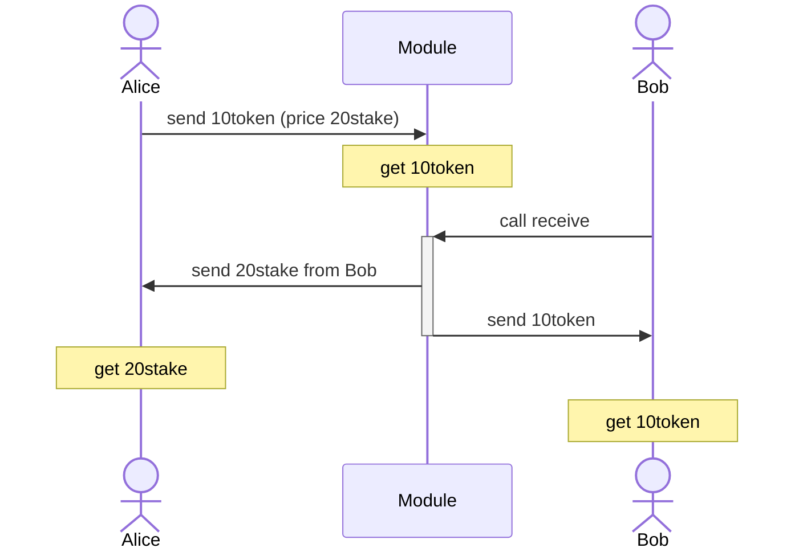
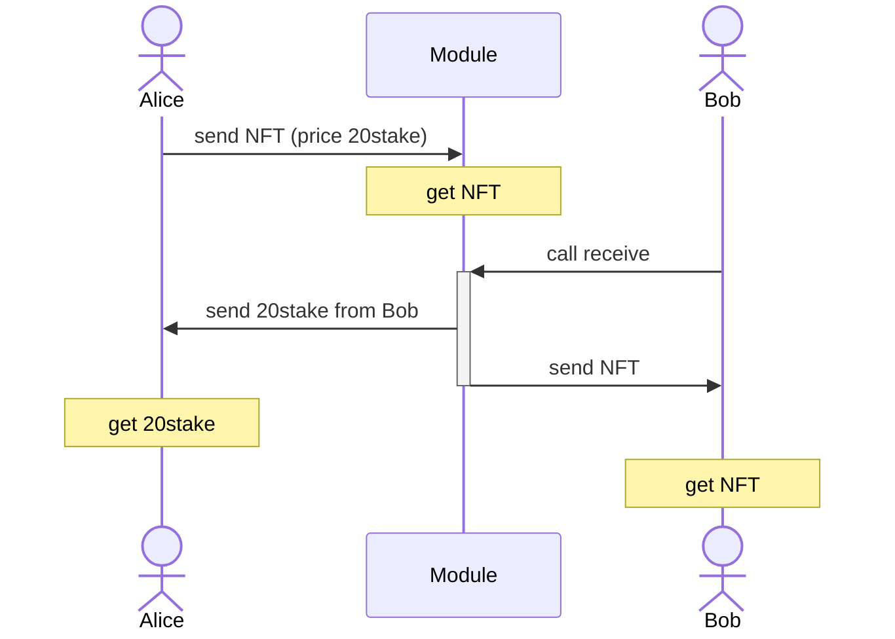

# cosmos-trustless-swap

**cosmos-trustless-swap** is a module for swapping and selling tokens between two users.  
It is implemented as [Cosmos module](https://github.com/cosmos/cosmos-sdk).


## Features

* Swap or Sell Fungible Token


* Swap or Sell Non Fungible Token


## Commands 

### Swap Fungible Token
```sh
tx swap send [id] [receiver] [amount] [amountToReceive] --from keyname
# ex) tx swap send 1 cosmos1p496u9my9uv6s3klsxuhud5y7jxwmd4lal8ym4 10coin 1stake --from alice
```

| proeprty   | description                                                                                                                                                                   | ex                |
|------------|-------------------------------------------------------------------------------------------------------------------------------------------------------------------------------|-------------------| 
| [id]       | Any number of type uint64. It must be unique for `--from` user. If swap is completed by `cancel` or `receive`, it can be reused.. If swap is completed by cancel or receive, it can be reused | 1                 |
| [receiver] | It is the recipient's address                                                                                                                                                 | cosmos1p496u9my9uv6s3klsxuhud5y7jxwmd4lal8ym4 |
| [amount] | It is the token to transfer                                                                                                                                                   | 10tokenA          |
| [amountToReceive] | The amount of tokens required for the recipient to receive                                                                                                                    | 20tokenB          |

```sh
query swap show [sender] [id] 
# ex) query swap show cosmos1s7p7h4k3v9qcqs7ku2tpq0cajydertggeg8z4m 1 

# Here is the result
# swap:
#  creator: cosmos1s7p7h4k3v9qcqs7ku2tpq0cajydertggeg8z4m
#  id: "1"
#  receiver: cosmos1p496u9my9uv6s3klsxuhud5y7jxwmd4lal8ym4
#  amount: 10tokenA
#  amountToReceive: 20tokenB
```

```sh
tx swap receive [sender] [id] --from keyname
# ex) tx swap receive cosmos1s7p7h4k3v9qcqs7ku2tpq0cajydertggeg8z4m 1 --from bob
```

| proeprty          | description                                                                             | ex                |
|-------------------|-----------------------------------------------------------------------------------------|-------------------| 
| [id]              | It is the id specified when sending                                                     | 1                 |
| [sender]          | The address of the sender.                                                              | cosmos1p496u9my9uv6s3klsxuhud5y7jxwmd4lal8ym4 |
| --from | It is the recipient. It must match the address specified in `[receiver]` in saved sale  | bob |

```sh
tx swap cancel [id] --from keyname
# ex) tx swap cancel 1 --from alice
```

| proeprty          | description                                                          | ex                |
|-------------------|----------------------------------------------------------------------|-------------------| 
| [id]              | It is the id specified when sending                                  | 1                 |
| --from | It is the sender. It must match the address specified in `[creator]` in saved sale | alice |


### Swap Non Fungible Token

```sh
tx swap send-nft [id] [receiver] [classId] [nftId] [amountToReceive] --from keyname
# ex) tx swap send-nft 1 cosmos1p496u9my9uv6s3klsxuhud5y7jxwmd4lal8ym4 class1 nft1 --from alice
```

| proeprty          | description                                                                                                                                                                                   | ex                                            |
|-------------------|-----------------------------------------------------------------------------------------------------------------------------------------------------------------------------------------------|-----------------------------------------------| 
| [id]              | Any number of type uint64. It must be unique for `--from` user. If swap is completed by `cancel` or `receive`, it can be reused.. If swap is completed by cancel or receive, it can be reused | 1                                             |
| [receiver]        | It is the recipient's address                                                                                                                                                                 | cosmos1p496u9my9uv6s3klsxuhud5y7jxwmd4lal8ym4 |
| [classId]         | It is the NFT's classId                                                                                                                                                                       | class1                                        |
| [nftId]           | It is the NFT's nftId                                                                                                                                                                         | class1                                        |
| [amountToReceive] | The amount of tokens required for the recipient to receive                                                                                                                                    | 20tokenB                                      |

```sh
query swap show-nft [sender] [id] 
# ex) query swap show-nft cosmos1s7p7h4k3v9qcqs7ku2tpq0cajydertggeg8z4m 1 

# Here is the result
# swap:
#  amountToReceive: 3token
#  classId: class1
#  creator: cosmos1s7p7h4k3v9qcqs7ku2tpq0cajydertggeg8z4m
#  id: "1"
#  nftId: nft1
#  receiver: cosmos1p496u9my9uv6s3klsxuhud5y7jxwmd4lal8ym4
```

```sh
tx swap receive-nft [sender] [id] --from keyname
# ex) tx swap receive-nft cosmos1s7p7h4k3v9qcqs7ku2tpq0cajydertggeg8z4m 1 --from bob
```

| proeprty          | description                                                                | ex                |
|-------------------|----------------------------------------------------------------------------|-------------------| 
| [id]              | It is the id specified when sending                                        | 1                 |
| [sender]          | The address of the sender                                                  | cosmos1p496u9my9uv6s3klsxuhud5y7jxwmd4lal8ym4 |
| --from | It is the recipient. It must match the address specified in `[receiver]` in saved sale  | bob |

```sh
tx swap cancel-nft [id] --from keyname
# ex) tx swap cancel-nft 1 --from alice
```

| proeprty          | description                                                          | ex                |
|-------------------|----------------------------------------------------------------------|-------------------| 
| [id]              | It is the id specified when sending                                  | 1                 |
| --from | It is the sender. It must match the address specified in `[creator]` in saved sale | alice |

### Sell Fungible Token

```sh
tx sale sell [id] [amount] [amountToReceive] --from keyname
# ex) tx sale sell 1 10coin 1stake --from alice
```

| proeprty   | description                                                                                                                                                                   | ex                |
|------------|-------------------------------------------------------------------------------------------------------------------------------------------------------------------------------|-------------------| 
| [id]       | Any number of type uint64. It must be unique for `--from` user. If swap is completed by `cancel` or `receive`, it can be reused.. If swap is completed by cancel or receive, it can be reused | 1                 |
| [amount] | It is the token to transfer                                                                                                                                                   | 10tokenA          |
| [amountToReceive] | The amount of tokens required for the recipient to receive                                                                                                                    | 20tokenB          |

```sh
query sale show [seller] [id] 
# ex) query sale show cosmos1s7p7h4k3v9qcqs7ku2tpq0cajydertggeg8z4m 1 

# Here is the result
# sell:
#  creator: cosmos1s7p7h4k3v9qcqs7ku2tpq0cajydertggeg8z4m
#  id: "1"
#  amount: 10tokenA
#  amountToReceive: 20tokenB
```

```sh
tx sale buy [seller] [id] --from keyname
# ex) tx sale buy cosmos1s7p7h4k3v9qcqs7ku2tpq0cajydertggeg8z4m 1 --from bob
```

| proeprty | description                                                         | ex                |
|----------|---------------------------------------------------------------------|-------------------| 
| [id]     | It is the id specified when sending                                 | 1                 |
| [seller] | The address of the seller.                                      | cosmos1p496u9my9uv6s3klsxuhud5y7jxwmd4lal8ym4 |
| --from   | It is the recipient | bob |

```sh
tx sale cancel [id] --from keyname
# ex) tx sale cancel 1 --from alice
```

| proeprty          | description                                                                        | ex                |
|-------------------|------------------------------------------------------------------------------------|-------------------| 
| [id]              | It is the id specified when sending                                                | 1                 |
| --from | It is the seller. It must match the address specified in `[creator]` in saved sale | alice |

### Sell Non Fungible Token

```sh
tx sale sell-nft [id] [classId] [nftId] [amountToReceive] --from keyname
# ex) tx sale sell-nft 1 class1 nft1 --from alice
```

| proeprty          | description                                                                                                                                                                               | ex                                            |
|-------------------|-------------------------------------------------------------------------------------------------------------------------------------------------------------------------------------------|-----------------------------------------------| 
| [id]              | Any number of type uint64. It must be unique for `--from` user. If swap is completed by `cancel` or `receive`, it can be reused.. If swap is completed by cancel or buy, it can be reused | 1                                             |
| [classId]         | It is the NFT's classId                                                                                                                                                                   | class1                                        |
| [nftId]           | It is the NFT's nftId                                                                                                                                                                     | class1                                        |
| [amountToReceive] | The amount of tokens required for the recipient to receive                                                                                                                                | 20tokenB                                      |

```sh
query sale show-nft [sender] [id] 
# ex) query sale show-nft cosmos1s7p7h4k3v9qcqs7ku2tpq0cajydertggeg8z4m 1 

# Here is the result
# sale:
#  amountToReceive: 3token
#  classId: class1
#  creator: cosmos1s7p7h4k3v9qcqs7ku2tpq0cajydertggeg8z4m
#  id: "1"
#  nftId: nft1
```

```sh
tx sale buy-nft [seller] [id] --from keyname
# ex) tx sale buy-nft cosmos1s7p7h4k3v9qcqs7ku2tpq0cajydertggeg8z4m 1 --from bob
```

| proeprty | description         | ex                |
|----------|---------------------|-------------------| 
| [id]     | It is the id specified when sending | 1                 |
| [seller] | The address of the seller | cosmos1p496u9my9uv6s3klsxuhud5y7jxwmd4lal8ym4 |
| --from   | It is the recipient | bob |

```sh
tx swap cancel-nft [id] --from keyname
# ex) tx swap cancel-nft 1 --from alice
```

| proeprty          | description                                                          | ex                |
|-------------------|----------------------------------------------------------------------|-------------------| 
| [id]              | It is the id specified when sending                                  | 1                 |
| --from | It is the seller. It must match the address specified in `[creator]` in saved sale | alice |

## Installation

```
go get -u github.com/yoshidan/cosmos-trustless-swap
```

Modify `app/app.go` included in the blockchain boilerplate output by [Ignite CLI](https://ignite.com/cli) as follows.  

* Import `nft` and `swap` and `sale` modules.
* `nft` is not required if you do not swap or sell NFTs.
```go
import (
	 ...
    "github.com/cosmos/cosmos-sdk/x/nft"
    nftkeeper "github.com/cosmos/cosmos-sdk/x/nft/keeper"
    nftmodule "github.com/cosmos/cosmos-sdk/x/nft/module"

    swapmodule "github.com/yoshidan/cosmos-trustless-swap/x/swap"
    swapmodulekeeper "github.com/yoshidan/cosmos-trustless-swap/x/swap/keeper"
    swapmoduletypes "github.com/yoshidan/cosmos-trustless-swap/x/swap/types"

    salemodule "github.com/yoshidan/cosmos-trustless-swap/x/sale"
    salemodulekeeper "github.com/yoshidan/cosmos-trustless-swap/x/sale/keeper"
    salemoduletypes "github.com/yoshidan/cosmos-trustless-swap/x/sale/types"	
)
```

* Add these modules to `ModuleBasics` and `maccPerms`
```go
var (
    ModuleBasics = module.NewBasicManager(
        ...
        nftmodule.AppModuleBasic{},
        swapmodule.AppModuleBasic{},
        salemodule.AppModuleBasic{}, 
    )

    maccPerms = map[string][]string{
        ...
        nft.ModuleName:                 nil,
        swapmoduletypes.ModuleName:     nil,
        salemoduletypes.ModuleName:     nil,
    }
)
```

* Add the `keepers` to `App` struct 
```go
type App struct {
    ...
    NFTKeeper  nftkeeper.Keeper
    SwapKeeper swapmodulekeeper.Keeper
    SaleKeeper salemodulekeeper.Keeper
}
```

* Initialize the modules in `func New`
```go
func New(
    ...
) *App {
    ...
    keys := sdk.NewKVStoreKeys(
        ...
        nft.StoreKey,
        swapmoduletypes.StoreKey,
        salemoduletypes.StoreKey,
    )
    ...
	
    app.NFTKeeper = nftkeeper.NewKeeper(
        keys[nft.StoreKey],
        appCodec,
        app.AccountKeeper,
        app.BankKeeper,
    )
    nftModules := nftmodule.NewAppModule(appCodec, app.NFTKeeper, app.AccountKeeper, app.BankKeeper, app.interfaceRegistry)

    app.SwapKeeper = *swapmodulekeeper.NewKeeper(
        appCodec,
        keys[swapmoduletypes.StoreKey],
        keys[swapmoduletypes.MemStoreKey],
        app.GetSubspace(swapmoduletypes.ModuleName),
        app.AccountKeeper,
        app.BankKeeper,
        app.NFTKeeper,
    )
    swapModule := swapmodule.NewAppModule(appCodec, app.SwapKeeper, app.AccountKeeper, app.BankKeeper)

    app.SaleKeeper = *salemodulekeeper.NewKeeper(
        appCodec,
        keys[salemoduletypes.StoreKey],
        keys[salemoduletypes.MemStoreKey],
        app.GetSubspace(salemoduletypes.ModuleName),
        app.BankKeeper,
        app.AccountKeeper,
        app.NFTKeeper,
    )
    saleModule := salemodule.NewAppModule(appCodec, app.SaleKeeper, app.AccountKeeper, app.BankKeeper)

    app.mm = module.NewManager(
        ...
        nftModules,
        swapModule,
        saleModule,
    )

    app.mm.SetOrderBeginBlockers(
        ...
        nft.ModuleName,
        swapmoduletypes.ModuleName,
        salemoduletypes.ModuleName,
    )

    app.mm.SetOrderEndBlockers(
        ...
        nft.ModuleName,
        swapmoduletypes.ModuleName,
        salemoduletypes.ModuleName,
    )
	
    app.mm.SetOrderInitGenesis(
        ...
        nft.ModuleName, 
        swapmoduletypes.ModuleName, 
        salemoduletypes.ModuleName, 
    )

    app.sm = module.NewSimulationManager(
        ...
        nftModules,
        swapModule,
        saleModule, 
    )
    ...
    return app
}
```

Then you can generate `openapi.yml` and TypeScript client.

```sh
ignite generate ts-client --clear-cache
ignite generate openapi --clear-cache
```
